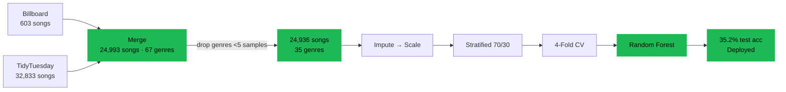
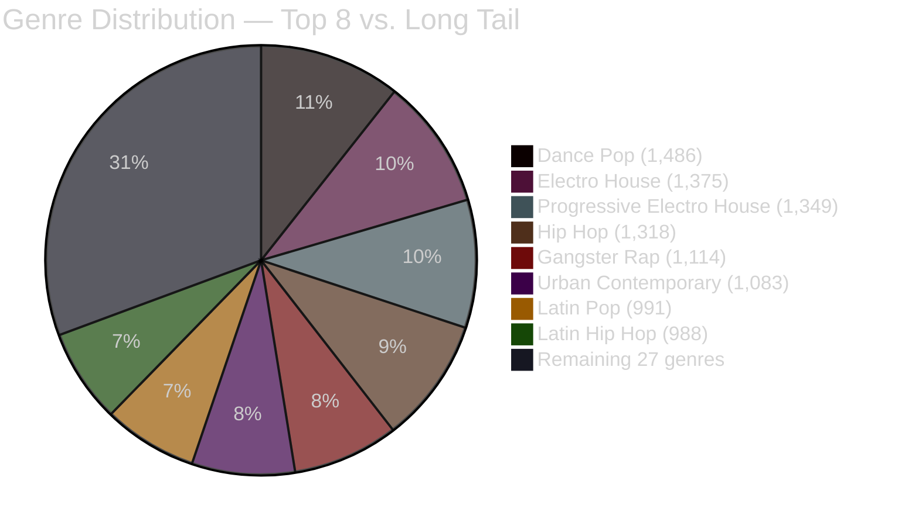
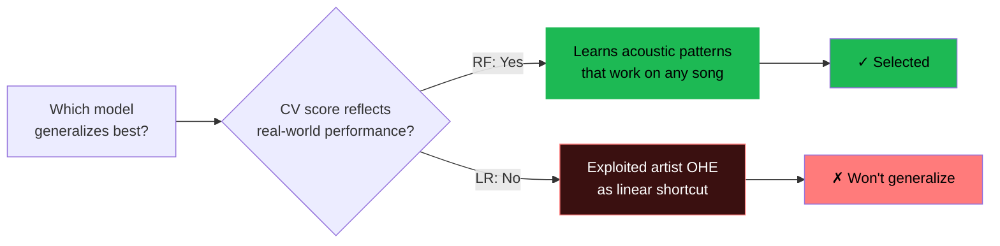

<div align="center">

# 🎵 Spotify Genre Classifier

**Can a model learn genre from sound alone?**

[](https://www.python.org/)
[](https://scikit-learn.org/)
[](https://spotify-genre-classifier.streamlit.app)
[](https://colab.research.google.com/github/mateoportillo1900/Spotify-ML-Model/blob/main/Spotify_ML_Project.ipynb)
[](LICENSE)

A multi-class classification system that predicts the genre of a song from its audio features alone — no artist identity, no metadata shortcuts. Trained on 24,993 Spotify tracks spanning 1957–2020.

**[→ Try the Live Dashboard](https://spotify-genre-classifier.streamlit.app)** &nbsp;·&nbsp; **[→ Methodology Deep-Dive](docs/METHODOLOGY.md)** &nbsp;·&nbsp; **[→ Training Notebook](Spotify_ML_Project.ipynb)**

</div>

---

## Headline Results

<table>
<tr>
<td align="center" width="25%">
<h3>35.2%</h3>
<sub>TEST ACCURACY<br/><sup>on held-out 30% split</sup></sub>
</td>
<td align="center" width="25%">
<h3>12×</h3>
<sub>VS. RANDOM BASELINE<br/><sup>2.9% chance @ 35 classes</sup></sub>
</td>
<td align="center" width="25%">
<h3>24,993</h3>
<sub>SONGS<br/><sup>1957–2020</sup></sub>
</td>
<td align="center" width="25%">
<h3>35</h3>
<sub>GENRES<br/><sup>after &lt;5-sample filter</sup></sub>
</td>
</tr>
</table>

---

## Table of Contents

- [The Problem](#the-problem)
- [Pipeline at a Glance](#pipeline-at-a-glance)
- [Dashboard](#dashboard)
- [Dataset](#dataset)
- [Models & Results](#models--results)
- [Feature Importance](#feature-importance)
- [Project Structure](#project-structure)
- [Getting Started](#getting-started)
- [Key Findings](#key-findings)
- [Methodology Deep-Dive →](docs/METHODOLOGY.md)
- [What I'd Do Differently With 2026 Tools](#what-id-do-differently-with-2026-tools)
- [License](#license)

---

## The Problem

Given the 11 numeric audio features Spotify exposes per track — tempo, energy, danceability, acousticness, speechiness, valence, loudness, liveness, popularity, duration — can a model recover the genre label?

The challenge is structural: **genre labels are cultural categories, not acoustic ones**. "Dance pop", "electropop", and "pop" overlap heavily in feature space. The random baseline for 35 classes is just 2.9%, so any meaningful signal counts.

---

## Pipeline at a Glance



For a full walk-through with cross-validation visualization, the audio-vs-artist trade-off, and per-fold scores: **[→ docs/METHODOLOGY.md](docs/METHODOLOGY.md)**

---

## Dashboard

Live interactive dashboard built with Streamlit. Five exploration tabs and four model-analysis tabs, plus a live genre predictor that runs inference in real time on slider input.

**Highlights:**
- Rotatable 3D feature space with user-controlled axes
- t-SNE 3D clustering of all 35 genres
- Audio fingerprint radar chart for genre-to-genre comparison
- 60-year audio feature trend line (1957–2020)
- Confusion matrix and per-genre recall breakdown
- **Live Genre Predictor** — dial in audio features, get real-time predictions with confidence scores

**[→ Open the live app](https://spotify-genre-classifier.streamlit.app)** &nbsp;·&nbsp; Or run locally: `streamlit run app.py`

---

## Dataset

| Property | Value |
|---|---|
| Sources | Billboard Top Songs (2010–2019) + TidyTuesday Spotify dataset |
| Raw size | 24,993 songs / 67 genres |
| After filtering | 24,936 songs / 35 genres (drops 32 genres with <5 samples) |
| Year range | 1957–2020 |
| Train / Test | 17,455 / 7,481 (70/30 stratified) |
| Audio features | BPM, Energy, Danceability, Loudness, Liveness, Valence, Acousticness, Speechiness, Popularity, Duration |

The dataset is severely long-tailed: dance pop has 1,486 songs while rare genres have 5–10. This is addressed with `class_weight='balanced'` during training so each class contributes equally to the loss regardless of frequency.



---

## Models & Results

Three supervised classifiers were benchmarked using stratified 4-fold cross-validation on the 70% training split. SVM was excluded — quadratic complexity makes it prohibitive at 25k samples.

| Model | Mean CV Accuracy | Final Test Accuracy | Why / Why Not |
|---|---|---|---|
| Logistic Regression | **43.71%** | — | Highest CV — but relied on artist OHE for an artist→genre shortcut. Would fail on unseen artists. |
| 🟢 **Random Forest** | 40.80% | **35.18%** | **Selected.** Audio-only feature set. Generalizes to any track the Spotify API can describe. |
| Decision Tree | 22.78% | — | Severe overfitting — ensemble methods are essential for this problem. |

> **Random baseline (35 classes) = 2.9%.** All models are well above chance, but only RF passes the "generalize to unseen artists" test.



**Deployed configuration:** Random Forest with `n_estimators=50`, `class_weight='balanced'`, `max_features='sqrt'`, `min_samples_leaf=2`. Notebook trains the GridSearchCV-tuned configuration (`n_estimators=200`); the Streamlit deployment uses a smaller forest to fit within the 1GB free-tier RAM limit.

---

## Feature Importance

The five highest-importance audio features in the deployed Random Forest:

| Rank | Feature | Role |
|---|---|---|
| 1 | **Energy** (`nrgy`) | Separates high-intensity EDM/rock from acoustic genres |
| 2 | **Acousticness** (`acous`) | Strong negative signal for electronic genres |
| 3 | **Speechiness** (`spch`) | Key driver for hip hop / rap classification |
| 4 | **Danceability** (`dnce`) | Distinguishes rhythm-driven genres |
| 5 | **Valence** (`val`) | Separates emotionally positive vs. darker genres |

These are computed from the trained forest's `feature_importances_` — averaged Gini importance across all 50 trees.

---

## Project Structure

```
Spotify-ML-Model/
├── app.py                     # Streamlit dashboard (live demo)
├── Spotify_ML_Project.ipynb   # Full training notebook with executable code
├── spotify_top_music.csv      # Merged dataset (24,993 songs)
├── requirements.txt
├── docs/
│   └── METHODOLOGY.md         # Visual methodology deep-dive (Mermaid diagrams)
├── architecture.html          # Standalone system architecture diagram
├── .streamlit/
│   └── config.toml            # Dark theme configuration
└── README.md
```

---

## Getting Started

**Prerequisites:**
```bash
pip install -r requirements.txt
```

**Run the training notebook:**
```bash
git clone https://github.com/mateoportillo1900/Spotify-ML-Model.git
cd Spotify-ML-Model
jupyter notebook Spotify_ML_Project.ipynb
```

**Run the dashboard locally:**
```bash
streamlit run app.py
```

---

## Key Findings

- **35 genres on audio alone is a genuinely hard problem.** Random baseline is 2.9% — the model at 35% is **12× better than chance**, with no artist identity and no metadata shortcuts.
- **Audio-only signals carry real classification power.** Hip hop (high speechiness), EDM (high energy + danceability), and acoustic pop (high acousticness) separate cleanly even when the model has never seen the artist before.
- **Music got louder and less acoustic over 60 years.** Acousticness cratered from the 1970s onward as music went electric; energy peaked during the EDM era of the 2010s.
- **Class imbalance dominates at scale.** Dance pop (1,486) vs. rare genres (5–10) is a 296× ratio. Balanced class weighting helps but more data for the long tail is the highest-leverage improvement.
- **Decision Tree overfits catastrophically.** 22.8% CV confirms ensemble methods are essential — a single tree memorizes patterns that don't transfer.

---

## What I'd Do Differently With 2026 Tools

A pre-trained audio embedding model — **CLAP**, **MERT**, or Spotify's internal track embeddings — paired with a **contrastive learning objective** would almost certainly outperform Random Forest on rare-class genres. The Spotify API features used here are aggregate statistics (mean energy, mean valence) which lose timbral and temporal structure that an embedding approach would preserve. A k-NN classifier over those embeddings, combined with a small head fine-tuned on the 35-class label set, is the path I'd take next.

---

## License

[MIT](LICENSE) — free to use, modify, and distribute with attribution.
