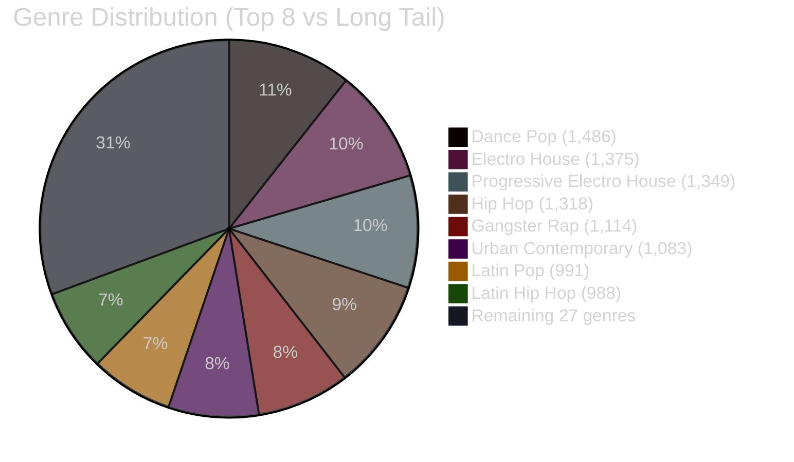
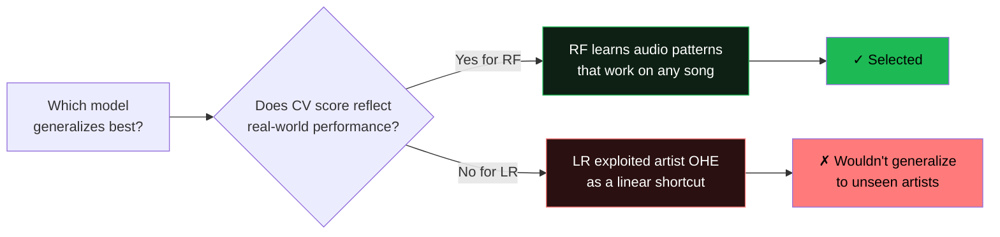
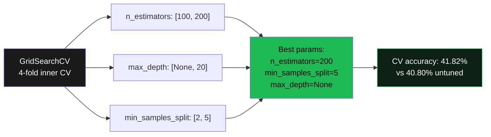

# Methodology

A visual walkthrough of how this project was built — the data pipeline, the modeling choices, and the trade-offs behind each decision.

> **Baseline context:** Random guessing across 35 classes scores **2.9%** (1 / 35). All meaningful results should be benchmarked against this. The deployed model at **35.18%** test accuracy is **12× above random**.

---

## Table of Contents

- [Data Flow](#data-flow)
- [Cross-Validation Strategy](#cross-validation-strategy)
- [Why Audio-Only Instead of Artist Features](#why-audio-only-instead-of-artist-features)
- [Class Imbalance and Balanced Weighting](#class-imbalance-and-balanced-weighting)
- [Model Selection: Why Random Forest Over Logistic Regression](#model-selection-why-random-forest-over-logistic-regression)
- [Hyperparameter Tuning](#hyperparameter-tuning)

---

## Data Flow

End-to-end pipeline from raw sources to deployed prediction.

```mermaid
flowchart LR
    A[Billboard Top Songs<br/>603 songs · 2010–2019] --> M[Merge<br/>24,993 songs · 67 genres]
    B[TidyTuesday Spotify<br/>32,833 songs · 1957–2020] --> M
    M --> |drop genres &lt;5 samples<br/>57 songs from 32 rare genres| D[Cleaned Dataset<br/>24,936 songs · 35 genres]
    D --> P[Preprocess]
    P --> |median imputation| P1[Imputed]
    P1 --> |z-score scaling| P2[Scaled]
    P2 --> S[Stratified Split]
    S --> |70%| TR[Training Set<br/>17,455 songs]
    S --> |30%| TE[Test Set<br/>7,481 songs]
    TR --> CV[4-Fold Cross-Validation]
    CV --> |benchmark| RF[Random Forest<br/>Selected Model]
    RF --> |evaluate on| TE
    TE --> |35.18% accuracy| OUT[Deployed Model<br/>Streamlit Cloud]

    style A fill:#1a1a1a,stroke:#666,color:#fff
    style B fill:#1a1a1a,stroke:#666,color:#fff
    style M fill:#1DB954,stroke:#1DB954,color:#000
    style D fill:#1a1a1a,stroke:#1DB954,color:#fff
    style RF fill:#1DB954,stroke:#1DB954,color:#000
    style OUT fill:#1DB954,stroke:#1DB954,color:#000
```

**Key decisions at each stage:**

| Stage | Decision | Rationale |
|---|---|---|
| Merge | Concatenate both sources after column mapping | TidyTuesday uses 0–1 scale; Billboard uses 0–100. Rescaled to align. |
| Clean | Drop genres with <5 samples | Stratified CV would otherwise put rare genres entirely in one fold |
| Preprocess | `SimpleImputer(strategy='median')` | Median is robust to skew in tempo/duration distributions |
| Preprocess | `StandardScaler` | Tree models don't strictly need it, but pipeline reusability matters |
| Split | Stratified 70/30 | Naïve random sampling would underrepresent rare genres in test |

---

## Cross-Validation Strategy

4-fold stratified cross-validation on the training set. Each fold uses 75% of training data for fitting and 25% for validation, repeated four times so every song is validated exactly once.

```mermaid
gantt
    title 4-Fold Stratified Cross-Validation
    dateFormat X
    axisFormat %s

    section Fold 1
    VALIDATE  :crit, f1v, 0, 25
    Train     :f1t1, 25, 100

    section Fold 2
    Train     :f2t1, 0, 25
    VALIDATE  :crit, f2v, 25, 50
    Train     :f2t2, 50, 100

    section Fold 3
    Train     :f3t1, 0, 50
    VALIDATE  :crit, f3v, 50, 75
    Train     :f3t2, 75, 100

    section Fold 4
    Train     :f4t1, 0, 75
    VALIDATE  :crit, f4v, 75, 100
```

**Final reported CV accuracy** = mean of the four validation scores. This gives a robust estimate that doesn't depend on a single lucky split.

| Model | Fold 1 | Fold 2 | Fold 3 | Fold 4 | Mean |
|---|---|---|---|---|---|
| Logistic Regression | 42.76% | 44.27% | 43.71% | 44.10% | **43.71%** |
| Random Forest | 40.03% | 41.50% | 40.80% | 40.85% | **40.80%** |
| Decision Tree | 22.50% | 23.15% | 22.78% | 22.69% | **22.78%** |

Stratification (`StratifiedKFold`) is critical here — without it, the 5–10 rare-genre songs would sometimes be entirely absent from training in a given fold, producing wildly variable validation scores.

---

## Why Audio-Only Instead of Artist Features

The single biggest modeling decision in this project. Here's the tradeoff visualized:

```mermaid
flowchart TB
    subgraph WithArtist["With Artist OHE — ~4,400 columns"]
        A1[11 Audio Features] --> A3[Combined Feature Vector]
        A2["~4,400 Artist One-Hot Columns"] --> A3
        A3 --> A4[Random Forest]
        A4 --> A5[43.7% CV Accuracy ✓]
        A5 --> A6[❌ Fails on unseen artists<br/>Mostly memorizes artist→genre lookups]
    end

    subgraph AudioOnly["Audio-Only — 11 columns DEPLOYED"]
        B1[11 Audio Features] --> B4[Random Forest]
        B4 --> B5[40.8% CV / 35.2% test]
        B5 --> B6[✓ Generalizes to any song<br/>Predictions grounded in acoustic signal]
    end

    style WithArtist fill:#2a1010,stroke:#ff7b7b
    style AudioOnly fill:#0e2014,stroke:#1DB954
    style A5 fill:#1a1a1a,color:#fff
    style A6 fill:#2a1010,color:#ff7b7b
    style B5 fill:#1a1a1a,color:#fff
    style B6 fill:#0e2014,color:#1DB954
```

The artist one-hot encoding inflates the feature space by ~400×. The model achieves higher CV accuracy because it can essentially memorize "Drake → hip hop" — but that's a metadata lookup, not a learned audio pattern. The deployed model intentionally drops these features to ensure predictions reflect actual acoustic signal.

---

## Class Imbalance and Balanced Weighting

The 35-genre target distribution is severely long-tailed.

| Tier | Genre count | Songs each |
|---|---|---|
| Major (≥500 songs) | 8 genres | 500–1,486 |
| Mid (50–499) | ~15 genres | 50–499 |
| Long tail (5–49) | ~12 genres | 5–49 |

**Without balanced weighting**, a classifier minimizing categorical cross-entropy would predict "dance pop" on most inputs and still score ~6% accuracy by frequency alone. `class_weight='balanced'` in scikit-learn rescales the loss so each class contributes equally to the gradient, regardless of frequency. This is doing real work — it's the difference between predicting only the top genres and actually trying to recover the rare ones.

---

## Model Selection: Why Random Forest Over Logistic Regression

Logistic Regression had a *higher* cross-validation score (43.71% vs 40.80%), so why wasn't it deployed?

LR with one-hot artist features finds a near-direct artist→genre mapping. That's a linear shortcut that wins on the training distribution but breaks on any new artist the model has never seen. Random Forest, with `max_features='sqrt'`, can't take that shortcut at every split — it has to find combinations of audio features that distinguish genres, which is the actual task.

---

## Hyperparameter Tuning

`GridSearchCV` over a small grid on the training set, evaluating with the same 4-fold CV.

**Deployment note:** The deployed model on Streamlit Cloud uses `n_estimators=50` (not the optimal 200) to fit within the free-tier 1GB RAM limit. The notebook trains the full configuration. This is documented in [README.md](../README.md#getting-started) and the in-app About page.

---

## See Also

- [README.md](../README.md) — Project overview and results summary
- [Spotify_ML_Project.ipynb](../Spotify_ML_Project.ipynb) — Full training notebook with executable code
- [Live Streamlit App](https://spotify-genre-classifier.streamlit.app) — Interactive dashboard
